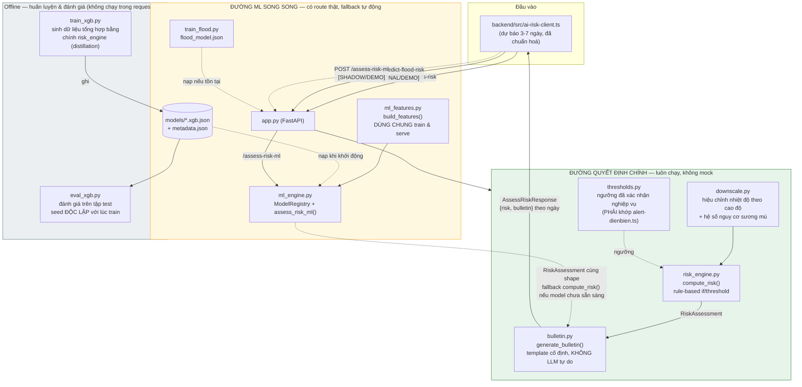
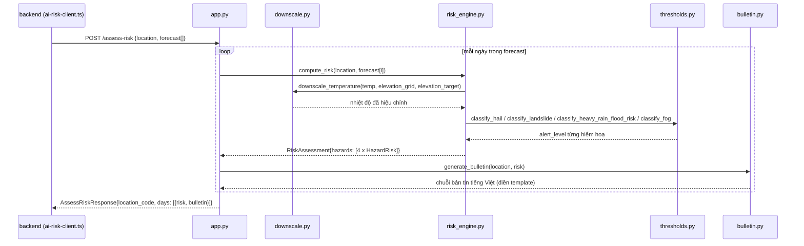

# Forestgump AI Engine

Dịch vụ **FastAPI** đánh giá rủi ro + sinh bản tin cảnh báo sớm 4 loại thiên
tai tại Điện Biên: **mưa đá**, **sạt lở đất**, **mưa lớn/lũ quét**, **sương mù
dày**. Đây là service AI trung tâm của hệ thống Forestgump (xem
`docs/architecture.md` cho kiến trúc toàn hệ thống, `../CLAUDE.md` cho tổng
quan monorepo).

> **Nguyên tắc cốt lõi:** rule engine (if/threshold đã xác nhận nghiệp vụ)
> là **nguồn quyết định duy nhất** cho `/assess-risk` — không có mock mode,
> không phụ thuộc model ML nào. Bên cạnh đó, service triển khai đầy đủ **2
> pipeline Machine Learning chạy song song**, cả 2 đã **nối vào route thật**
> (`/predict-flood-risk`, `/assess-risk-ml`) theo mô hình *model distillation
> + shadow deployment*, nhưng không thay thế rule engine cho tới khi có dữ
> liệu quan trắc thật để kiểm chứng độc lập. Phần dưới giải thích vì sao đây
> là lựa chọn kiến trúc AI-native có chủ đích, không phải thiếu ML.

**7 endpoint hiện có:** `GET /health`, `POST /assess-risk` (nguồn quyết định
chính), `POST /predict-flood-risk` (ML nhị phân, tham khảo), `POST
/assess-risk-ml` (ML multi-hazard, shadow — xem mục 6.5), `GET
/terrain-communes` + `POST /assess-terrain-risk` + `GET
/assess-terrain-risk-live` (ML sạt lở/lũ quét theo 130 xã, train từ đặc
trưng địa hình DEM thật + mưa live Open-Meteo — xem mục 7).

---

## Mục lục

1. [Sơ đồ kiến trúc tổng thể](#1-sơ-đồ-kiến-trúc-tổng-thể)
2. [Nguyên tắc thiết kế AI-native](#2-nguyên-tắc-thiết-kế-ai-native)
3. [Thành phần & vai trò](#3-thành-phần--vai-trò)
4. [Luồng xử lý 1 request](#4-luồng-xử-lý-1-request)
5. [Nhánh ML #1 — Lũ quét nhị phân (đã nối vào service)](#5-nhánh-ml-1--lũ-quét-nhị-phân-đã-nối-vào-service)
6. [Nhánh ML #2 — Multi-hazard multi-class (đã nối `/assess-risk-ml`, shadow)](#6-nhánh-ml-2--multi-hazard-multi-class-đã-nối-assess-risk-ml-shadow)
7. [Nhánh ML #3 — Sạt lở + lũ quét theo 130 xã (DEM thật + mưa live)](#7-nhánh-ml-3--sạt-lở--lũ-quét-theo-130-xã-dem-thật--mưa-live)
8. [Hợp đồng API](#8-hợp-đồng-api)
9. [Cài đặt & chạy](#9-cài-đặt--chạy)
10. [Huấn luyện & đánh giá lại model](#10-huấn-luyện--đánh-giá-lại-model)
11. [Testing](#11-testing)
12. [Docker](#12-docker)
13. [Giới hạn đã biết & nguyên tắc an toàn](#13-giới-hạn-đã-biết--nguyên-tắc-an-toàn)
14. [Roadmap](#14-roadmap)
15. [Cấu trúc thư mục](#15-cấu-trúc-thư-mục)

---

## 1. Sơ đồ kiến trúc tổng thể



**Đọc sơ đồ:** `/assess-risk` (đường liền, khối xanh) luôn đi qua rule
engine để ra kết quả cuối cùng dùng cho cảnh báo thật. `/assess-risk-ml`
(đường đứt, khối vàng) là một **route thật, gọi độc lập**, dùng
`ml_engine.assess_risk_ml()` thay `compute_risk()` nhưng tái sử dụng cùng
`bulletin.py` — tự quay lại kết quả của rule engine nếu model chưa train
hoặc lỗi nạp, không bao giờ làm hỏng response. Khối xám là pipeline offline,
chạy tách biệt hoàn toàn khỏi request path của service.

---

## 2. Nguyên tắc thiết kế AI-native

Đây là phần lý giải kiến trúc — không chỉ liệt kê "có XGBoost", mà mỗi mục
dưới đây tương ứng trực tiếp với 1 đoạn code cụ thể trong repo.

### 2.1. Train/serve parity (một nguồn build feature duy nhất)
`ml_features.py::build_features()` là **hàm duy nhất** sinh vector đặc trưng
18 chiều, được `train_xgb.py` gọi lúc huấn luyện và `ml_engine.py` gọi lúc
suy luận. `FEATURE_NAMES` là hằng số cố định thứ tự cột; `ModelRegistry._load()`
**đối chiếu `metadata.json["feature_names"]` với `FEATURE_NAMES` hiện tại lúc
khởi động** — nếu lệch (vd. code đổi feature nhưng quên train lại), service
từ chối nạp model thay vì âm thầm suy luận sai:

```python
if metadata.get("feature_names") != FEATURE_NAMES:
    raise ValueError("... model đã train với bộ đặc trưng cũ, cần train lại.")
```

### 2.2. Model registry pattern (load-once, cache, hot-reload)
`ml_engine.ModelRegistry` nạp cả 3 Booster XGBoost + metadata **một lần khi
import module** (biến `_registry` cấp module), không nạp lại mỗi request.
`reload_models()` cho phép nạp lại từ đĩa sau khi train lại mà không cần
khởi động lại process — dùng cho `eval_xgb.py` và test.

### 2.3. Graceful degradation — service không bao giờ trả lỗi 500 vì thiếu model
Cả 2 nhánh ML đều có đường fallback tường minh, không dùng try/except nuốt
lỗi im lặng:
- `assess_risk_ml()`: nếu `ModelRegistry.is_ready == False`, trả thẳng kết
  quả `compute_risk()` (rule engine) và **gắn cờ vào `detail`** của từng
  hazard (`"[FALLBACK RULE ENGINE — model XGBoost chưa sẵn sàng: ...]"`) để
  không âm thầm trả kết quả sai nguồn.
- `POST /predict-flood-risk` (`app.py`): nếu chưa chạy `train_flood.py`
  (không có `flood_model.json`), tự chuyển sang công thức mock
  (`_true_flood_probability`) và trả `mode="mock"` thay vì lỗi.

### 2.4. Model distillation có chủ đích, không phải "ML giả"
Điện Biên chưa có CSDL quan trắc thiên tai lịch sử (`docs/architecture.md`
mục 5). Thay vì bịa số liệu hoặc bỏ qua ML, dự án chọn **distillation**:
`train_xgb.py::generate_synthetic_dataset()` sinh hàng chục nghìn kịch bản
thời tiết ngẫu nhiên phủ kín không gian đặc trưng (kể cả vùng biên các
ngưỡng — vd. mưa quanh mốc 100/200/400mm/24h, tầm nhìn quanh 50/1000m), gán
nhãn bằng **chính** `risk_engine.compute_risk()`, rồi train XGBoost học lại
ranh giới quyết định đó. `metadata.json["label_source"] = "rule_engine_distillation"`
ghi rõ nguồn gốc nhãn — khi có dữ liệu quan trắc thật, chỉ cần thay hàm sinh
dữ liệu, toàn bộ `ml_engine.py` (inference) giữ nguyên.

### 2.5. Evaluation pipeline tách biệt khỏi training, chống data leakage
`eval_xgb.py` dùng `RANDOM_SEED + 1` (khác `train_xgb.py`) để sinh tập test
**độc lập**, không trùng dữ liệu đã train — tránh accuracy ảo. Báo cáo gồm
accuracy, MAE risk_score (so trên thang điểm liên tục 0-100, không chỉ
nhãn rời rạc), và confusion matrix theo từng hiểm hoạ, xuất JSON tái lập
được (`--save-report`).

### 2.6. Traceability — mọi kết quả ML tự khai báo nguồn gốc
Response của `assess_risk_ml()` không chỉ trả `alert_level`, mà `detail`
luôn nêu rõ đây là kết quả XGBoost, agreement với rule engine trên tập test
là bao nhiêu %, và xác suất từng lớp:
```
"[XGBoost, agreement với rule engine trên tập test: 99.7%] Xác suất lớp: green=0.02, yellow=0.91, orange=0.07, red=0.00."
```
Điều này biến mỗi câu trả lời ML thành một khẳng định có thể kiểm chứng,
thay vì một con số "hộp đen".

### 2.7. Versioned, self-describing model artifacts
Mỗi lần `train_xgb.py` chạy, `models/metadata.json` ghi lại `trained_at`
(ISO timestamp), `n_samples`, `feature_names`, `label_source`, và với từng
hazard: tên file model, danh sách lớp theo đúng thứ tự mã hoá lúc train,
`test_accuracy`. Đây là artifact tối thiểu để truy vết "model này train khi
nào, trên bao nhiêu mẫu, đạt accuracy bao nhiêu" — không cần thêm hệ thống
MLOps ngoài (MLflow/W&B) cho quy mô MVP hiện tại.

### 2.8. Guardrail rõ ràng cho nội dung sinh tự động
`bulletin.py` **cố tình không dùng LLM tự do** để sinh nội dung cảnh báo —
chỉ điền biến (`location_name`, `date`) vào `TEMPLATES` đã kiểm duyệt trước
theo cặp `(hazard, alert_level)`. Đây là quyết định AI-safety có chủ đích:
nội dung ảnh hưởng an toàn tính mạng (khuyến nghị hành động khi lũ quét/rét
hại) cần nhất quán 100%, không chấp nhận rủi ro mô hình ngôn ngữ sinh sai
lệch hoặc ảo giác (hallucination). Generative AI có chỗ đứng ở lớp khác của
hệ thống (vd. `chat.ts`/`gemini-client.ts` ở backend cho hỏi-đáp tự do),
không ở lớp phát cảnh báo.

### 2.9. Shadow deployment — cùng data contract, khác nguồn quyết định
Nhánh multi-hazard (`ml_engine.assess_risk_ml`) trả về đúng kiểu
`RiskAssessment` giống hệt `risk_engine.compute_risk`, nên `POST
/assess-risk-ml` (`app.py`) tái dùng **nguyên vẹn** `AssessRiskRequest`,
`DayAssessment` và `bulletin.generate_bulletin()` của `/assess-risk` — chỉ
đổi nguồn tính risk. Đây đúng nghĩa *shadow deployment*: gọi được trên cùng
payload thật, cùng lúc với đường quyết định chính, để so sánh trực tiếp 2
nguồn (`detail` của mỗi hazard tự khai nguồn — xem mục 2.6) mà không cần
thiết kế lại data contract hay động vào `/assess-risk`. Route này **không**
thay `/assess-risk` cho cảnh báo thật (xem mục 6.5) — dùng để demo/so sánh.

### 2.10. Reproducibility
Mọi bước sinh dữ liệu tổng hợp đều dùng `numpy.random.default_rng(seed)`
với seed cố định (`RANDOM_SEED = 42` cho train, `RANDOM_SEED + 1` cho eval)
— kết quả train/eval lặp lại được giữa các lần chạy, phục vụ so sánh khi
đổi hyperparameter.

---

## 3. Thành phần & vai trò

| File | Vai trò | Loại |
|---|---|---|
| `app.py` | REST service: `GET /health`, `POST /assess-risk`, `POST /predict-flood-risk`, `POST /assess-risk-ml` | Serving |
| `thresholds.py` | Ngưỡng cảnh báo đã xác nhận nghiệp vụ (NCHMF / QĐ 18/2021/QĐ-TTg / WMO). **PHẢI khớp** `backend/src/alert-dienbien.ts` | Domain rules |
| `downscale.py` | Hiệu chỉnh nhiệt độ theo cao độ (lapse rate ~0.65°C/100m) + hệ số nguy cơ sương mù theo địa hình | Domain rules |
| `risk_engine.py` | `compute_risk()` — rule engine chính, nguồn quyết định duy nhất cho `/assess-risk` | **Primary decisioning** |
| `bulletin.py` | `generate_bulletin()` — sinh bản tin từ template cố định đã kiểm duyệt | **Guardrailed generation** |
| `ml_features.py` | `build_features()` — feature engineering dùng chung train/serve, 18 chiều | ML — shared |
| `train_xgb.py` | Sinh dữ liệu tổng hợp (distillation từ rule engine) + train 3 model multi-class | ML — offline training |
| `ml_engine.py` | `ModelRegistry`, `assess_risk_ml()`, `is_model_ready()` — inference cho 3 hiểm hoạ, tự fallback rule engine, đã nối `POST /assess-risk-ml` | ML — shadow inference |
| `eval_xgb.py` | Đánh giá accuracy/MAE/confusion matrix trên tập test độc lập | ML — evaluation |
| `train_flood.py` | Train model nhị phân xác suất lũ quét (đã nối vào `app.py`) | ML — offline training |
| `models/` | `*.xgb.json` (model đã train) + `metadata.json` (versioning) | ML — artifacts |
| `flood_model.json` | Model lũ quét đã train (sinh bởi `train_flood.py`, optional) | ML — artifact |
| `test_*.py` | Unit test cho từng module, gồm `test_ml_engine.py` cho `/assess-risk-ml` | QA |

---

## 4. Luồng xử lý 1 request



`/predict-flood-risk` là một luồng **tách biệt hoàn toàn**, không ảnh hưởng
tới luồng trên — xem mục 5. `/assess-risk-ml` dùng **đúng luồng trên**, chỉ
thay bước `APP->>RE: compute_risk(...)` bằng `APP->>REG: assess_risk_ml(...)`
(`ml_engine.py`) — bước `generate_bulletin()` và response shape giữ nguyên,
xem mục 6.5.

---

## 5. Nhánh ML #1 — Lũ quét nhị phân (đã nối vào service)

- **Bài toán:** xác suất lũ quét (0-1) từ 5 đặc trưng: `rain_24h_mm`,
  `rain_12h_mm`, `terrain_multiplier` (tra từ `thresholds.TERRAIN_FLOOD_MULTIPLIER`),
  `elevation_m`, `humidity_pct`.
- **Nhãn huấn luyện:** sinh bằng `_true_flood_probability()` — hàm sigmoid
  quanh mốc cường độ mưa 150mm (điều chỉnh theo hệ số địa hình), **không
  phải công thức khí tượng đã thẩm định**, chỉ tạo hình dạng dữ liệu hợp lý
  cho mục đích demo.
- **Model:** `xgb.Booster` nhị phân (`binary:logistic`), 300 vòng boosting,
  early stopping 20 vòng trên tập validation (85/15 split).
- **Serving:** `app.py` nạp `flood_model.json` một lần khi khởi động (nếu
  tồn tại) → `mode="model"`; nếu không tồn tại hoặc lỗi nạp → dùng lại chính
  công thức sinh nhãn làm fallback → `mode="mock"`. Không bao giờ lỗi 500.
- **Vị trí trong quyết định:** THAM KHẢO bổ sung — **không** dùng để tính
  `alert_level` của `/assess-risk`.

```bash
python train_flood.py                 # ghi flood_model.json
python -m unittest test_flood -v      # test feature engineering + endpoint
```

---

## 6. Nhánh ML #2 — Multi-hazard multi-class (đã nối `/assess-risk-ml`, shadow)

### 6.1. Vector đặc trưng (18 chiều, `ml_features.FEATURE_NAMES`)

| # | Đặc trưng | Nguồn | Ghi chú |
|---|---|---|---|
| 1-3 | `temp_min_c`, `temp_max_c`, `avg_temp_c` | forecast (đã downscale theo cao độ) | |
| 4-6 | `precipitation_mm`, `rain_12h_mm`, `rain_1h_mm` | forecast | 12h/1h = NaN nếu nguồn dự phòng OpenWeatherMap |
| 7-8 | `humidity_pct`, `humidity_max_pct` | forecast | |
| 9-11 | `dew_point_c`, `dew_spread_c`, `dew_spread_min_c` | forecast / tính toán | `dew_spread_min_c` = tín hiệu sương mù mạnh nhất (đêm/rạng sáng) |
| 12 | `visibility_min_m` | forecast (hourly Open-Meteo) | tín hiệu trực tiếp sương mù, WMO |
| 13-14 | `wind_speed_kmh`, `wind_gusts_kmh` | forecast | |
| 15 | `soil_moisture_0_1` | forecast | |
| 16-18 | `terrain_thung_lung`, `terrain_nui_cao`, `terrain_ven_suoi` | one-hot từ `location.terrain` | |

Trường thiếu (nguồn dự phòng không cung cấp hourly) = `NaN` — XGBoost xử lý
missing value tự nhiên (split hướng mặc định học được lúc train), không cần
impute thủ công.

### 6.2. Huấn luyện (`train_xgb.py`)
- `sample_scenario()` sinh kịch bản ngẫu nhiên có **phân giải mịn quanh biên
  ngưỡng** (vd. 50% mẫu mưa trong dải 0-80mm để học sát ngưỡng vàng 100mm;
  45% mẫu tầm nhìn trong dải 10m-2km để học sát ngưỡng WMO 50m/1000m) — tránh
  model học kém ở đúng vùng quyết định quan trọng nhất.
- 85% kịch bản có đủ trường hourly (giả lập tỉ lệ Open-Meteo/OpenWeatherMap
  thực tế), 15% thiếu — để model quen với input NaN khi serving.
- `xgb.XGBClassifier`: `n_estimators=800`, `max_depth=7`, `learning_rate=0.07`,
  `subsample=0.9`, `colsample_bytree=0.9`, `objective=multi:softprob`,
  `early_stopping_rounds=40` trên tập validation tách riêng từ tập train
  (tập test hoàn toàn không tham gia chọn số cây).

### 6.3. Suy luận & quy đổi điểm (`ml_engine.py`)
`HazardModel.predict()` lấy `predict_proba` cho từng lớp
(`green/yellow/orange/red`), rồi quy `risk_score` 0-100 bằng **trung bình
có trọng số theo midpoint của mỗi band** (`_BAND_MIDPOINT`, tính từ chính
`thresholds.SCORE_YELLOW_MIN/ORANGE_MIN/RED_MIN`) — dùng **cùng thang điểm**
với rule engine để 2 nguồn so sánh trực tiếp được, không lệch đơn vị.
`assess_risk_ml()` gọi `HazardModel.predict()` cho cả 3 hiểm hoạ rồi trả về
đúng kiểu `RiskAssessment` — đây là hàm được `POST /assess-risk-ml` (`app.py`)
gọi trực tiếp, xem mục 6.5.

### 6.4. Kết quả đánh giá gần nhất

Train: `n_samples=60000` (`models/metadata.json`, `trained_at=2026-07-18`).
Eval: tập test 10,000 mẫu, seed độc lập với lúc train.

| Hiểm hoạ | Test accuracy (lúc train) | Accuracy (eval độc lập) | MAE risk_score (thang 0-100) |
|---|---|---|---|
| cold_damage | 0.9972 | 0.9999 | 7.25 |
| heavy_rain_flood | 0.9955 | 0.9975 | 6.21 |
| fog | 0.9925 | 0.9961 | 10.86 |

> **Đọc con số này thế nào cho đúng:** accuracy cao (~99%) chỉ chứng minh
> XGBoost **tái tạo đúng ranh giới quyết định** mà rule engine đã học được từ
> ngưỡng nghiệp vụ, **không** chứng minh bản thân ngưỡng đó đúng với thời
> tiết Điện Biên thật — vì nhãn huấn luyện đến từ chính rule engine
> (`label_source: rule_engine_distillation`), không phải quan trắc thật.
> Số MAE của `fog` cao hơn 2 hiểm hoạ còn lại vì công thức `fog_risk_factor()`
> (heuristic nội bộ) có 2 tín hiệu chồng chéo (tầm nhìn WMO + hệ số nhiệt-độ-ẩm)
> khiến ranh giới band phức tạp hơn — xem `risk_engine._fog_risk()`.

```bash
python train_xgb.py --samples 40000                            # train + in accuracy tập test nội bộ
python eval_xgb.py --samples 10000 --save-report models/eval_report.json   # eval độc lập
```

### 6.5. `POST /assess-risk-ml` — [SHADOW/DEMO] route đã nối, KHÔNG phải nguồn quyết định

Cùng payload với `/assess-risk` (mục 7), trả về **cùng shape**
`{location_code, days: [{risk, bulletin}]}` — chỉ thêm 1 trường `mode`:

```json
{
  "location_code": "tua-chua",
  "mode": "model",
  "days": [
    {
      "risk": {
        "location_code": "tua-chua", "date": "2026-07-17",
        "hazards": [
          {"hazard": "cold_damage", "alert_level": "red", "risk_score": 92.5,
           "detail": "[XGBoost, agreement với rule engine trên tập test: 99.7%] Xác suất lớp: green=0.00, red=1.00, yellow=0.00."}
        ]
      },
      "bulletin": "[Dân/cán bộ xã] CẢNH BÁO RÉT HẠI tại Xã Tủa Chùa ngày 2026-07-17 — nguy hiểm sức khoẻ. ..."
    }
  ]
}
```

- `mode: "model"` — cả 3 model multi-hazard đã nạp thành công
  (`ml_engine.is_model_ready()`), response dùng thật XGBoost.
- `mode: "fallback_rule_engine"` — model chưa train (chưa chạy
  `train_xgb.py`) hoặc lỗi nạp; response quay về `compute_risk()`, mỗi hazard
  tự đánh dấu `[FALLBACK RULE ENGINE — ...]` trong `detail` (mục 2.3, 2.6).
  Endpoint **không bao giờ trả lỗi 500** trong cả 2 trường hợp.

**Vì sao route đã tồn tại nhưng vẫn không phải nguồn quyết định:** model
được distill từ chính rule engine trên dữ liệu tổng hợp (mục 2.4) — dùng nó
thay `compute_risk()` cho cảnh báo thật khi chưa có dữ liệu quan trắc để
kiểm chứng độc lập sẽ tạo ảo giác "đã có ML thật" trong khi bản chất vẫn là
rule engine tái mã hoá qua cây quyết định. `/assess-risk-ml` tồn tại đúng
với vai trò *shadow deployment*: gọi song song trên payload thật để so sánh
2 nguồn (qua `mode` + `detail` từng hazard), phục vụ demo và làm nền cho
quyết định "khi nào đủ tin cậy để đổi nguồn chính" — quyết định đó cần dữ
liệu quan trắc thật, không phải chỉ cần code (xem mục 12).

---

## 7. Nhánh ML #3 — Sạt lở + lũ quét theo 130 xã (DEM thật + mưa live)

Nhánh ML mới nhất, khác biệt căn bản với nhánh #1/#2: **train trên bảng đặc
trưng địa hình THẬT tính từ DEM** cho từng xã Điện Biên
([`docs/dienbien_risk_theo_xa.csv`](../docs/dienbien_risk_theo_xa.csv), bản
sao service tại `data/dienbien_risk_theo_xa.csv` — 130 xã × 15 cột), không
phải dữ liệu tổng hợp. Dự đoán 2 hiểm hoạ mới: **sạt lở đất** (`satlo`) và
**lũ quét theo xã** (`luquet`).

### 7.1. Vector đặc trưng (9 chiều, `terrain_features.TERRAIN_FEATURE_NAMES`)

| Nhóm | Feature | Nguồn |
|---|---|---|
| Địa hình (tĩnh) | `slope_mean_deg` — độ dốc trung bình | DEM (CSV) |
| | `log_flow_accum` — log1p(tích tụ dòng chảy max) | DEM (CSV) |
| | `twi_mean` — Topographic Wetness Index | DEM (CSV) |
| | `curvature_std` — độ lệch chuẩn độ cong địa hình | DEM (CSV) |
| | `elevation_m` — độ cao centroid | **Open-Meteo Elevation API** (cache `data/commune_elevation.json`) |
| Mưa (động) | `rain_1h_mm`, `rain_24h_mm`, `rain_72h_mm` — mưa vừa qua | CSV lúc train; **Open-Meteo Forecast API** (`past_days=3`) lúc serve live |
| | `rain_next_24h_mm` — dự báo mưa 24h tới | CSV lúc train; Open-Meteo lúc serve live |

Nhãn: `risk_satlo`/`risk_luquet` (0-1, hồi quy `reg:squarederror`). Cấp cảnh
báo 1-5 quy đổi bằng ngưỡng **0.2/0.4/0.6/0.8**
(`terrain_features.risk_score_to_level` — khớp 100% cột `muc_canhbao_*`
trong CSV, cùng tinh thần cấp độ rủi ro thiên tai QĐ 18/2021/QĐ-TTg).

### 7.2. Live API — càng nhiều đặc trưng live càng tốt, nhưng tách bạch

Endpoint `GET /assess-terrain-risk-live?commune=<tên xã>` gọi 2 API miễn
phí, không cần key, ngay tại centroid xã (`live_features.py`):

- **Open-Meteo Forecast API** — mưa thật 1h/24h/72h vừa qua + dự báo 24h
  tới (**đưa thẳng vào model**, thay snapshot tĩnh trong CSV), kèm độ ẩm
  đất 0-7cm (`soil_moisture_0_to_7cm`) và xác suất mưa lớn nhất 24h tới.
- **Open-Meteo Flood API (GloFAS)** — lưu lượng sông hôm nay + đỉnh 7 ngày
  tới (m³/s).

Độ ẩm đất, xác suất mưa và lưu lượng sông trả về trong `live_context` để
tham khảo, **KHÔNG đưa vào model** — dữ liệu huấn luyện (CSV) chưa có các
cột này nên đưa vào sẽ phá train/serve parity (nguyên tắc 2.1). Khi CSV
phiên bản sau bổ sung các cột đó, chỉ cần thêm vào
`TERRAIN_FEATURE_NAMES` + train lại.

### 7.3. Huấn luyện (`train_terrain.py`) & kết quả

130 mẫu là dataset nhỏ → cây nông (`max_depth=3`), learning rate thấp,
regularization, và báo cáo bằng **5-fold cross-validation** (không phải
accuracy trên tập train):

| Hiểm hoạ | CV R² | CV MAE | Đúng cấp cảnh báo |
|---|---|---|---|
| Sạt lở (`satlo`) | 0.967 | 0.0195 | 92% |
| Lũ quét (`luquet`) | 0.927 | 0.0217 | 88% |

Top feature theo gain: sạt lở ← `rain_72h_mm`, `curvature_std`,
`slope_mean_deg`; lũ quét ← `rain_24h_mm`, `log_flow_accum`, `twi_mean` —
khớp trực giác vật lý (sạt lở do mưa tích luỹ dài + địa hình dốc; lũ quét
do mưa cường độ ngắn + tụ nước).

### 7.4. An toàn — cùng nguyên tắc graceful degradation

- Chưa chạy `train_terrain.py` (hoặc load lỗi) → tự fallback về risk score
  baseline tính sẵn trong CSV, response ghi rõ `mode: "csv_baseline"` —
  không bao giờ 500 vì thiếu model (nguyên tắc 2.3, 2.6).
- Flood API lỗi → `live_context.river_discharge_* = null`, response vẫn 200.
- Nhãn `risk_satlo`/`risk_luquet` là **chỉ số mô hình hoá** từ DEM + mưa,
  chưa phải thống kê thiệt hại lịch sử → toàn nhánh gắn tag [THAM KHẢO],
  `/assess-risk` (rule engine) vẫn là nguồn cảnh báo chính thức.

---

## 8. Hợp đồng API

### `POST /assess-risk`
Nhận 1 địa điểm + dự báo 3-7 ngày (khớp `DailyForecast` trong
`backend/src/weather-types.ts`):

```json
{
  "location": {"code": "tua-chua", "name": "Xã Tủa Chùa", "elevation_m": 871.0, "terrain": "nui_cao"},
  "forecast": [
    {
      "date": "2026-07-17", "temp_min_c": 11.5, "temp_max_c": 13.0, "precipitation_mm": 250.0,
      "humidity_pct": 96.0, "dew_point_c": 12.0, "wind_speed_kmh": 4.0,
      "cape_max_jkg": 1800.0, "freezing_level_min_m": 4200.0, "soil_moisture_9_to_27cm": 0.3,
      "showers_sum_mm": 8.0, "rain_3d_mm": 260.0
    }
  ]
}
```

Trả về (rule engine, luôn hoạt động):
```json
{
  "location_code": "tua-chua",
  "days": [
    {
      "risk": {
        "location_code": "tua-chua", "date": "2026-07-17",
        "hazards": [
          {"hazard": "hail", "alert_level": "yellow", "risk_score": 41.2, "detail": "..."},
          {"hazard": "landslide", "alert_level": "green", "risk_score": 12.0, "detail": "..."},
          {"hazard": "heavy_rain_flood", "alert_level": "red", "risk_score": 92.4, "detail": "..."},
          {"hazard": "fog", "alert_level": "green", "risk_score": 8.0, "detail": "..."}
        ]
      },
      "bulletin": "[Dân/cán bộ xã] Cảnh báo NGUY CƠ MƯA ĐÁ ...\n[Dân/cán bộ xã] NGUY HIỂM: LŨ QUÉT ..."
    }
  ]
}
```

### `POST /assess-risk-ml` — [SHADOW/DEMO]
Cùng payload `AssessRiskRequest` với `/assess-risk` ở trên (mục 8). Trả về
`{location_code, mode: "model" | "fallback_rule_engine", days: [{risk, bulletin}]}`
— xem ví dụ đầy đủ + giải thích ở mục 6.5. **Không** dùng để tính cảnh báo
thật; dùng cho demo/so sánh song song với `/assess-risk`.

### `POST /predict-flood-risk` — [OPTIONAL/DEMO]
```json
{"rain_24h_mm": 250.0, "rain_12h_mm": 150.0, "terrain": "ven_suoi", "elevation_m": 540.0, "humidity_pct": 95.0}
```
Trả về `{"flood_probability": 0.0-1.0, "mode": "model" | "mock"}`.

### `GET /terrain-communes` — [THAM KHẢO]
Danh bạ 130 xã (tên, centroid, độ dốc, TWI, cấp cảnh báo baseline) — nguồn
cho dropdown/bản đồ phía dashboard.

### `POST /assess-terrain-risk` — [THAM KHẢO]
```json
{"commune": "Mường Phăng", "rain_24h_mm": 45.0, "rain_72h_mm": 120.0}
```
Số liệu mưa bỏ trống thì dùng snapshot trong CSV. Trả về:
```json
{
  "commune": "Mường Phăng",
  "satlo":  {"risk_score": 0.32, "warning_level": 2, "mode": "model"},
  "luquet": {"risk_score": 0.16, "warning_level": 1, "mode": "model"},
  "rain_used_mm": {"rain_1h_mm": 0.3, "rain_24h_mm": 45.0, "rain_72h_mm": 120.0, "rain_next_24h_mm": 6.7}
}
```
`mode: "csv_baseline"` nếu chưa chạy `train_terrain.py`. Xã không có trong
danh bạ → 404.

### `GET /assess-terrain-risk-live?commune=<tên xã>` — [THAM KHẢO]
Như trên nhưng mưa lấy **live** từ Open-Meteo tại centroid xã, thêm:
```json
{
  "live_context": {
    "fetched_at": "2026-07-19T01:22:33+07:00",
    "soil_moisture_0_7cm": 0.495,
    "precip_prob_max_next_24h_pct": 100.0,
    "river_discharge_m3s": 2.91,
    "river_discharge_max_7d_m3s": 3.84
  }
}
```
Lỗi Open-Meteo Forecast API → 502; lỗi Flood API → các trường
`river_discharge_*` = `null`, vẫn 200.

### `GET /health`
`{"status": "ok"}` — dùng cho `HEALTHCHECK` trong Dockerfile.

---

## 9. Cài đặt & chạy

```bash
python -m venv .venv && .venv/Scripts/activate   # Windows (PowerShell/Git Bash)
pip install -r requirements.txt
uvicorn app:app --reload --port 8000
```

## 10. Huấn luyện & đánh giá lại model

```bash
# Nhánh multi-hazard (shadow, đã nối /assess-risk-ml)
python train_xgb.py --samples 40000
python eval_xgb.py --samples 10000 --save-report models/eval_report.json

# Nhánh lũ quét nhị phân (đã nối /predict-flood-risk)
python train_flood.py

# Nhánh sạt lở + lũ quét theo 130 xã (đã nối /assess-terrain-risk*)
python train_terrain.py --fetch-elevation   # lần đầu: gọi Elevation API + cache
python train_terrain.py                     # các lần sau: dùng cache độ cao
```
Sau khi train lại, khởi động lại `uvicorn` (hoặc gọi `ml_engine.reload_models()`
trong test/script) để nạp model mới.

## 11. Testing

```bash
python -m pytest -q          # chạy toàn bộ (pytest gom cả test unittest cũ)
# hoặc kiểu cũ, không gồm test_terrain:
python -m unittest test_downscale test_risk test_bulletin test_flood test_ml_engine -v
```
| Test file | Phạm vi |
|---|---|
| `test_downscale.py` | Hiệu chỉnh nhiệt độ theo cao độ + hệ số nguy cơ sương mù |
| `test_risk.py` | Ngưỡng `thresholds.py` (đối chiếu `alert-dienbien.test.ts`) + `compute_risk()` |
| `test_bulletin.py` | Sinh bản tin từ template |
| `test_flood.py` | Feature engineering + `POST /predict-flood-risk` |
| `test_ml_engine.py` | `assess_risk_ml()` + `POST /assess-risk-ml` (shape, traceability trong `detail`, không lỗi 500 nhiều ngày) |
| `test_terrain.py` | Nhánh #3: nạp CSV 130 xã, ngưỡng cấp 1-5, parse payload Open-Meteo/GloFAS (offline), `POST /assess-terrain-risk`, 404, fallback mode |

Thủ công: `GET /health`, `POST /assess-risk`, `POST /predict-flood-risk`,
`POST /assess-risk-ml`, `POST /assess-terrain-risk` với payload ở mục 8.

## 12. Docker

```bash
docker build -t forestgump-ai-engine ./ai_engine
docker run -p 8000:8000 forestgump-ai-engine
```
`Dockerfile` copy code service + `data/` (danh bạ 130 xã + cache độ cao —
cần cho `/terrain-communes` và fallback `csv_baseline`) + `HEALTHCHECK` gọi
`/health`. `flood_model.json` và `models/` mặc định **không** được copy vào
image (dòng `COPY` bị comment out) — service tự chạy ở mode
fallback (`mock`/`fallback_rule_engine`/`csv_baseline`) cho tới khi build
lại với model đã train, đúng nguyên tắc "luôn trả lời được, không lỗi vì
thiếu model".

## 13. Giới hạn đã biết & nguyên tắc an toàn

- **Không có dữ liệu lịch sử/quan trắc thật** cho 3 loại thiên tai ở Điện
  Biên — mọi ngưỡng dựa trên văn bản nghiệp vụ (NCHMF, QĐ 18/2021/QĐ-TTg,
  WMO), chưa được kiểm định bằng số liệu thực tế. Vì vậy accuracy ~99% của
  nhánh ML đo mức độ khớp với rule engine, **không phải** độ chính xác so
  với thời tiết thật.
- `downscale_temperature()` là xấp xỉ tuyến tính (lapse rate chuẩn), bỏ qua
  nghịch nhiệt — sai số lớn hơn khi chênh cao >1000m hoặc đêm mùa đông ở
  lòng chảo (Điện Biên Phủ).
- `fog_risk_factor()` là heuristic nội bộ dự án, chưa đối chiếu quan trắc.
- `bulletin.py` cố tình không dùng LLM tự do sinh nội dung an toàn tính
  mạng — chỉ thêm template mới vào `TEMPLATES` khi cần, không đổi sang
  generation tự do.
- **`POST /assess-risk-ml` chỉ để demo/so sánh**, tuyệt đối không dùng làm
  nguồn cảnh báo thật (xem mục 6.5) — model phía sau nó chưa được kiểm chứng
  độc lập với rule engine bằng dữ liệu quan trắc thật.
- Nhãn `risk_satlo`/`risk_luquet` của nhánh #3 (mục 7) là **chỉ số mô hình
  hoá** từ DEM + mưa (chưa phải thống kê thiệt hại lịch sử); CV R² cao đo
  mức khớp với chỉ số đó, không phải với sạt lở/lũ quét thật. GloFAS độ phân
  giải ~5km — tại suối nhỏ miền núi chỉ mang tính tham khảo.
- Chi tiết đầy đủ + nguồn tham chiếu từng ngưỡng: `docs/architecture.md`
  mục 4, 5.

## 14. Roadmap

**Đã hoàn thành:**
- `POST /assess-risk-ml` (mục 6.5) — route shadow cho nhánh multi-hazard,
  chạy song song `/assess-risk` trên payload thật, tự báo `mode` để phân
  biệt kết quả XGBoost thật với fallback rule engine.
- Nhánh ML #3 (mục 7) — model sạt lở + lũ quét theo 130 xã train từ đặc
  trưng DEM thật (`docs/dienbien_risk_theo_xa.csv`), mưa live Open-Meteo +
  GloFAS qua `/assess-terrain-risk-live`.

Theo khuyến nghị review (`docs/eval.odt`), các hướng sau **ngoài phạm vi
MVP** hiện tại:

- Model ML dự báo thời tiết riêng (thay Open-Meteo/ECMWF).
- Model xác suất lũ quét học trên dữ liệu quan trắc **thật** (khi Điện Biên
  công khai CSDL lịch sử thiên tai) — thay `generate_synthetic_dataset()`/
  `build_dataset()` bằng bước đọc dữ liệu thật, giữ nguyên toàn bộ
  `ml_engine.py`/`app.py`.
- Dùng kết quả so sánh từ `/assess-risk-ml` (đã nối, xem trên) trên dữ liệu
  quan trắc thật để quyết định có đổi nguồn quyết định chính hay không —
  bản thân việc bật route không đủ, cần dữ liệu để kiểm chứng độc lập.
- Chuyển `thresholds.py`/`alert-dienbien.ts` sang file cấu hình JSON/YAML
  dùng chung, giảm nguy cơ lệch ngưỡng giữa backend và AI Engine.

## 15. Cấu trúc thư mục

```
ai_engine/
├── app.py                  # FastAPI service — 7 endpoints (health, assess-risk, predict-flood-risk, assess-risk-ml, terrain-communes, assess-terrain-risk[-live])
├── risk_engine.py          # Rule engine — nguồn quyết định chính
├── thresholds.py           # Ngưỡng cảnh báo đã xác nhận nghiệp vụ
├── downscale.py            # Hiệu chỉnh nhiệt độ theo cao độ + hệ số sương mù
├── bulletin.py             # Sinh bản tin từ template (guardrailed)
├── ml_features.py          # Feature engineering dùng chung train/serve (nhánh #2)
├── ml_engine.py            # ModelRegistry + inference multi-hazard (shadow)
├── train_xgb.py            # Train 3 model multi-class (distillation)
├── eval_xgb.py             # Đánh giá độc lập trên tập test riêng
├── train_flood.py          # Train model nhị phân xác suất lũ quét
├── flood_model.json        # [optional] model lũ quét đã train
├── terrain_features.py     # Nhánh #3: nạp CSV 130 xã + build feature chung train/serve
├── terrain_engine.py       # Nhánh #3: TerrainRegistry + predict, fallback csv_baseline
├── train_terrain.py        # Nhánh #3: train 2 model hồi quy satlo/luquet (5-fold CV)
├── live_features.py        # Live API: Open-Meteo Forecast/Flood(GloFAS)/Elevation
├── data/
│   ├── dienbien_risk_theo_xa.csv   # Bản sao docs/ — 130 xã, DEM + mưa + risk baseline
│   └── commune_elevation.json      # Cache độ cao (train_terrain.py --fetch-elevation)
├── models/
│   ├── cold_damage.xgb.json
│   ├── heavy_rain_flood.xgb.json
│   ├── fog.xgb.json
│   ├── metadata.json       # Versioning: trained_at, feature_names, accuracy
│   ├── eval_report.json    # Kết quả eval_xgb.py gần nhất
│   └── terrain/
│       ├── satlo.xgb.json      # Model hồi quy risk sạt lở
│       ├── luquet.xgb.json     # Model hồi quy risk lũ quét
│       └── metadata.json       # trained_at, feature_names, CV R²/MAE/đúng-cấp
├── test_*.py                # Unit test (test_downscale, test_risk, test_bulletin, test_flood, test_ml_engine, test_terrain)
├── requirements.txt
└── Dockerfile
```
